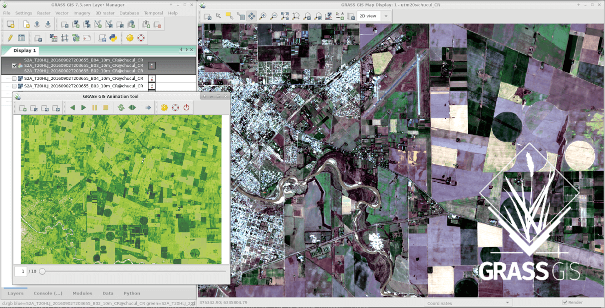

# Procesamiento de series de tiempo en GRASS GIS: Aplicaciones en Ecologia y Ambiente.

## Edit: Adopted for **Coding in Geo Kenya Mini Webinar Session** for demo and practice purposes

Data, code and slides for the post-graduate course that will be held in Rio Cuarto (Cordoba, Argentina) in October, 2018



## Slides and exercises

### Slides:

- [GRASS GIS intro](https://gitlab.com/veroandreo/curso-grass-gis-rioiv/-/blob/master/pdf/01_general_intro_grass.pdf)
- [GRASS GIS general capabilities](https://gitlab.com/veroandreo/curso-grass-gis-rioiv/-/blob/master/pdf/02_general_intro_capabilities.pdf)
- [Raster data processing](https://gitlab.com/veroandreo/curso-grass-gis-rioiv/-/blob/master/pdf/03_raster.pdf)
- [Satellite imagery processing](https://gitlab.com/veroandreo/curso-grass-gis-rioiv/-/blob/master/pdf/04_imagery.pdf)
- [Temporal data processing](https://gitlab.com/veroandreo/curso-grass-gis-rioiv/-/blob/master/pdf/05_temporal.pdf)
- [GRASS and R interface](https://gitlab.com/veroandreo/curso-grass-gis-rioiv/-/blob/master/pdf/06_R_grass.pdf)

### Exercises:

- [Getting familiar with GRASS GIS](https://gitlab.com/veroandreo/curso-grass-gis-rioiv/-/blob/master/pdf/01_exercise_getting_familiar.pdf)
- [Create new location and import maps](https://gitlab.com/veroandreo/curso-grass-gis-rioiv/-/blob/master/pdf/02_exercise_create_new_location.pdf)
- [Landscape, hydrology and terrain analysis](https://gitlab.com/veroandreo/curso-grass-gis-rioiv/-/blob/master/pdf/03_exercise_raster.pdf)
- [Working with Sentinel 2 images](https://gitlab.com/veroandreo/curso-grass-gis-rioiv/-/blob/master/pdf/04_exercise_processing_sentinel2.pdf)
- [Hands-on to NDVI time series](https://gitlab.com/veroandreo/curso-grass-gis-rioiv/-/blob/master/pdf/05_exercise_ndvi_time_series.pdf)
- [GRASS and R: Predicting species distribution](https://gitlab.com/veroandreo/curso-grass-gis-rioiv/-/blob/master/pdf/06_exercise_predicting_spp_distributions.pdf)

## Software

We will use **GRASS GIS 7.4.1** (current stable version). It can be installed either 
through standalone installers/binaries or through OSGeo-Live (which includes all
OSGeo software and packages).

### Standalone installers for different OS:

##### MS Windows

There are two different options:
1. Standalone installer: [32-bit version](https://grass.osgeo.org/grass74/binary/mswindows/native/x86/WinGRASS-7.4.1-1-Setup-x86.exe) | [64-bit version](https://grass.osgeo.org/grass74/binary/mswindows/native/x86_64/WinGRASS-7.4.1-1-Setup-x86_64.exe) 
2. OSGeo4W package (network installer): [32-bit version](http://download.osgeo.org/osgeo4w/osgeo4w-setup-x86.exe) | [64-bit version](http://download.osgeo.org/osgeo4w/osgeo4w-setup-x86_64.exe) 

For Windows users, **we strongly recommend installing GRASS GIS through the OSGeo4W package**, 
since it allows to install all OSGeo software. If you choose this option, 
*make sure you select GRASS GIS and msys*. The latter one will allow 
the use of loops, back ticks, autocomplete, history and other nice bash shell
features.

##### Mac OS

Download GRASS GIS 7.4.1 stable from: http://grassmac.wikidot.com/downloads and follow the instructions under *Installing GRASS for Mac*.

##### Ubuntu Linux

Install GRASS GIS 7.4.1 from the "unstable" package repository:

```
sudo add-apt-repository ppa:ubuntugis/ubuntugis-unstable
sudo apt-get update
sudo apt-get install grass
```

##### Fedora, openSuSe Linux

For other Linux distributions including **Fedora** and **openSuSe**, simply install GRASS GIS with the respective package manager. See also [here](https://grass.osgeo.org/download/software/)

##### Extra dependencies

The following are some Python libraries that are needed by add-ons that will be used in the course:
- [pyModis](http://www.pymodis.org) 
- [sentinelsat](https://github.com/sentinelsat/sentinelsat)
- pandas
- matplotlib
- pygbif

See the [Installation guide](https://gitlab.com/veroandreo/curso-grass-gis-rioiv/-/blob/master/pdf/00_installation.pdf) presentation for details.

### OSGeo-live: 

[OSGeo-live](https://live.osgeo.org/) is a self-contained bootable DVD, USB thumb
drive or Virtual Machine based on Lubuntu, that allows you to try a wide variety
of open source geospatial software without installing anything. There are 
different options to run OSGeo-live:

* [Run OSGeo-live in a Virtual Machine](https://live.osgeo.org/en/quickstart/virtualization_quickstart.html)
* [Run OSGeo-live from a bootable USB flash drive](https://live.osgeo.org/en/quickstart/usb_quickstart.html)

For a quick-start guide, see: https://live.osgeo.org/en/quickstart/osgeolive_quickstart.html

### GRASS GIS Add-ons that will be used during the course

* [r.diversity](https://grass.osgeo.org/grass7/manuals/addons/r.diversity.html): Calculates diversity indices based on a moving window
* [r.forestfrag](https://grass.osgeo.org/grass7/manuals/addons/r.forestfrag.html): Computes the forest fragmentation index
* [r.stream.distance](https://grass.osgeo.org/grass7/manuals/addons/r.stream.distance.html): Calculates distance to and elevation above streams and outlet
* [r.lake.series](https://grass.osgeo.org/grass7/manuals/addons/r.lake.series.html): Fills lake at given point(s) to given levels
* [i.sentinel](https://grass.osgeo.org/grass7/manuals/addons/i.sentinel.html): Toolset for download and processing of Copernicus Sentinel products
* [i.fusion.hpf](https://grass.osgeo.org/grass7/manuals/addons/i.fusion.hpf.html): Fusion of high resolution panchromatic and low resolution multi-spectral data based on the High-Pass Filter Addition technique
* [i.landsat8.qc](https://grass.osgeo.org/grass7/manuals/addons/i.landsat8.qc.html): Reclassifies Landsat8 QA band according to pixel quality
* [i.wi](https://grass.osgeo.org/grass7/manuals/addons/i.wi.html): Calculates different types of water indices
* [i.superpixels.slic](https://grass.osgeo.org/grass7/manuals/addons/i.superpixels.slic.html): Perform image segmentation using the SLIC segmentation method
* [i.modis](https://grass.osgeo.org/grass7/manuals/addons/i.modis.html): Toolset for download and processing of MODIS products using pyModis
* [r.hants](https://grass.osgeo.org/grass7/manuals/addons/r.hants.html): Approximates a periodic time series and creates approximated output
* [r.seasons](https://grass.osgeo.org/grass7/manuals/addons/r.seasons.html): Extracts seasons from a time series
* [r.regression.series](https://grass.osgeo.org/grass7/manuals/addons/r.regression.series.html): Calculates linear regression parameters between two time series
* [v.strds.stats](https://grass.osgeo.org/grass7/manuals/addons/v.strds.stats.html): Zonal statistics from given space-time raster datasets based on a polygons vector map
* [v.in.pygbif](https://grass.osgeo.org/grass7/manuals/addons/v.in.pygbif.html): Search and import GBIF species distribution data with filters
<!---
* [r.learn.ml](https://grass.osgeo.org/grass7/manuals/addons/r.learn.ml.html): Supervised classification and regression of GRASS GIS raster maps using the python scikit-learn package
--->
Install with `g.extension extension=name_of_addon`

## Data

* [North Carolina location (full dataset, 150Mb)](https://grass.osgeo.org/sampledata/north_carolina/nc_spm_08_grass7.zip): download and unzip within `$HOME/grassdata`.
* [Sample raster maps](https://gitlab.com/veroandreo/curso-grass-gis-rioiv/raw/3b11ad06d2133889e0ee51652a03f94bfec9d7e4/data/sample_rasters.zip?inline=false): download and unzip within `$HOME/gisdata`.
* [Streets vector map (gpkg)](https://gitlab.com/veroandreo/curso-grass-gis-rioiv/raw/master/data/streets.gpkg?inline=false): download and move into `$HOME/gisdata`.
* [Landsat 8 scenes clipped to North Carolina](https://gitlab.com/veroandreo/curso-grass-gis-rioiv/raw/master/data/NC_L8_scenes.zip?inline=false): download and unzip within `$HOME/gisdata`.
* [Sentinel 2 scene (500Mb)](https://www.dropbox.com/s/2k8wg9i05mqgnf1/S2A_MSIL1C_20180822T155901_N0206_R097_T17SQV_20180822T212023.zip?dl=0): download and move into `$HOME/gisdata`. DO NOT UNZIP.
* [Aeronet AOD file](https://gitlab.com/veroandreo/curso-grass-gis-rioiv/raw/master/data/180819_180825_EPA-Res_Triangle_Pk.zip?inline=false): download and unzip within `$HOME/gisdata`.
* [modis_lst mapset (2Mb)](https://gitlab.com/veroandreo/curso-grass-gis-rioiv/raw/master/data/modis_lst.zip?inline=false): download and unzip within the North Carolina location in `$HOME/grassdata/nc_spm_08_grass7`.
* [modis_ndvi (15 Mb)](https://gitlab.com/veroandreo/curso-grass-gis-rioiv/raw/master/data/modis_ndvi.zip?inline=false): download and unzip within the North Carolina location in `$HOME/grassdata/nc_spm_08_grass7`.

## The trainer

**Verónica Andreo** is a researcher for [CONICET](http://www.conicet.gov.ar/?lan=en)
working at the Institute of Tropical Medicine [(INMeT)](https://www.argentina.gob.ar/salud/inmet)
in Puerto Iguazú, Argentina. Her main interests are remote sensing and GIS tools
for disease ecology research fields and applications. 
Vero is an [OSGeo](http://www.osgeo.org/) Charter member and a [FOSS4G](http://foss4g.org/) 
enthusiast and advocate. 
She is part of the [GRASS GIS Development team](https://grass.osgeo.org/home/credits/) 
and she also teaches introductory and advanced courses and workshops, especially 
on GRASS GIS [time series modules](https://grasswiki.osgeo.org/wiki/Temporal_data_processing)
and their applications.

## Contributors

Many thanks to GRASS developers and community members that have developed other 
educational materials from which I recycled and adapted some of the examples for
this course. A special thanks to [Carol Garzon](https://gitlab.com/carolgarzon) 
who contributed the examples for r.li.* modules and the workflow for species 
distribution modeling in R that were further adapted for this course.

## License

All the course material:

[](http://creativecommons.org/licenses/by-sa/4.0/) Creative Commons Attribution-ShareAlike 4.0 International License

Presentations were created with [gitpitch](https://gitpitch.com/):

* MIT License
